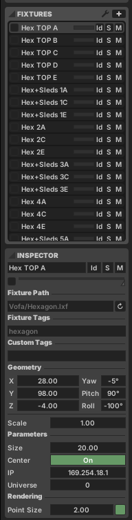
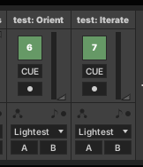
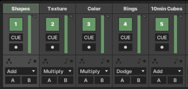
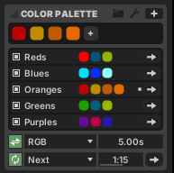

README.md

Hexagons: 331 LEDs (2 universes)

Hexagon+Sleds: 571 LEDs (4 universes)

11 hexagons = 3641

9 hex+sleds = 5139

Offset list:

0, 331, 662, 993, 1324, 1655

0, 571, 1142

## Installation

Find your Chromatik directory (user home/Chromatik) and drop the repo files there preserving the existing folders.

Open `Projects/Vofa.lxp`

## Fixture Setup

These are configured for DDP which gets picked up by WLED. Set IPs and data offsets if fixtures aren't quite right.

Rotation's probably wrong on these so update the Roll parameter to rotate. Note that I was having some program crashes when updating these values with click-and-drag; recommend just typing in a number and seeing if that fixes things.

### Test Patterns

Use these patterns to properly orient the fixtures. Click CUE to quickly enable these. `Orient` draws the first 5 pixels of each fixture as white. `Iterate` highlights each pixel one-at-a-time.

### Channels

First 3 channels here are just from the demo sketch.

Rings adds some rotating rings 40% of the time, sometimes from palette colors, sometimes from rainbow.

10min cubes: so about every 10 minutes, we do this floating cube pattern for one minute. The code for that is in `Scripts/CubeRotate.js`.

### Palettes

One for each element

### What to Change

Go through and delete stuff you don't like especially in the first 3 channels. Tweak things. Add LFO's to different values.

## Performance Mode

On site, switch from Design mode to Performance mode.

Consider lowering the FPS if you're dropping frames. I would bet 30-40 is the most you can get reliably.

